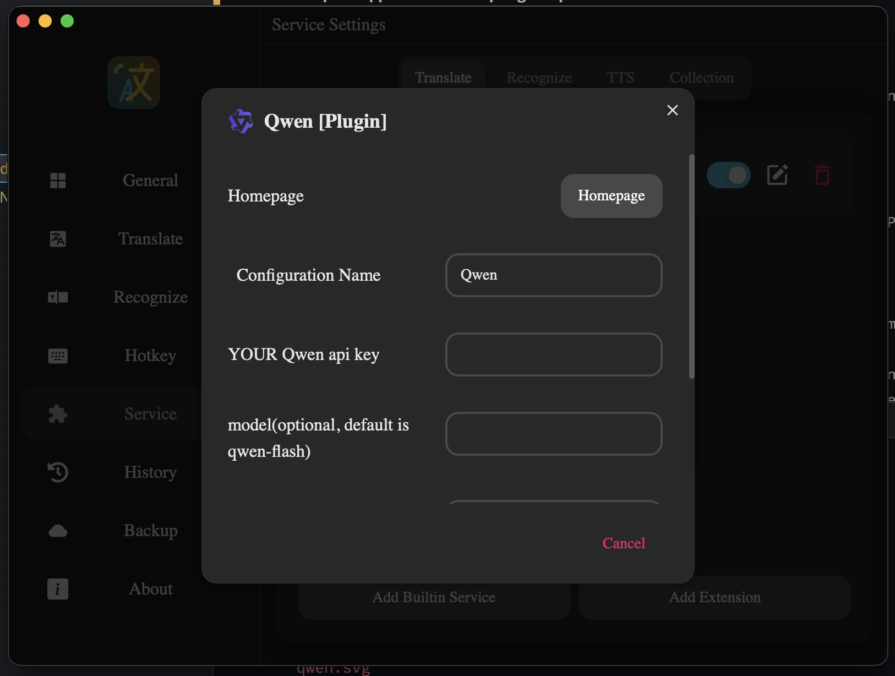
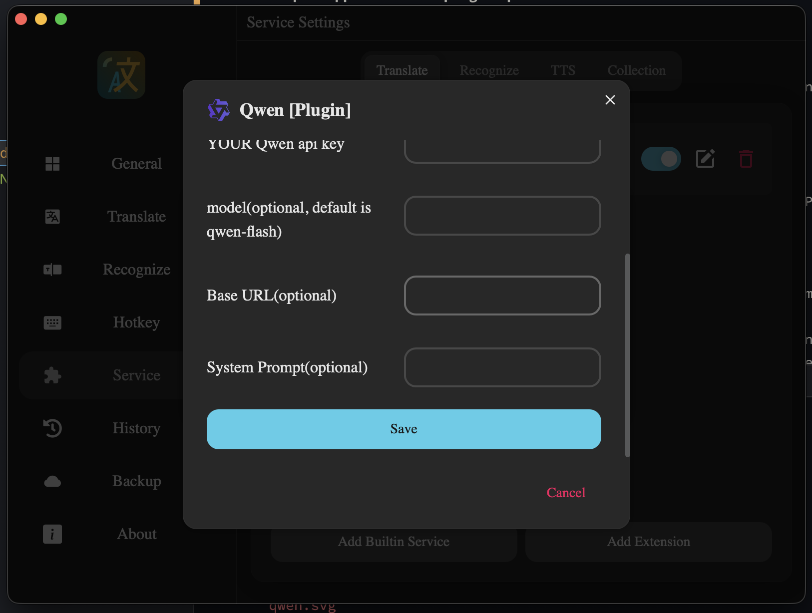
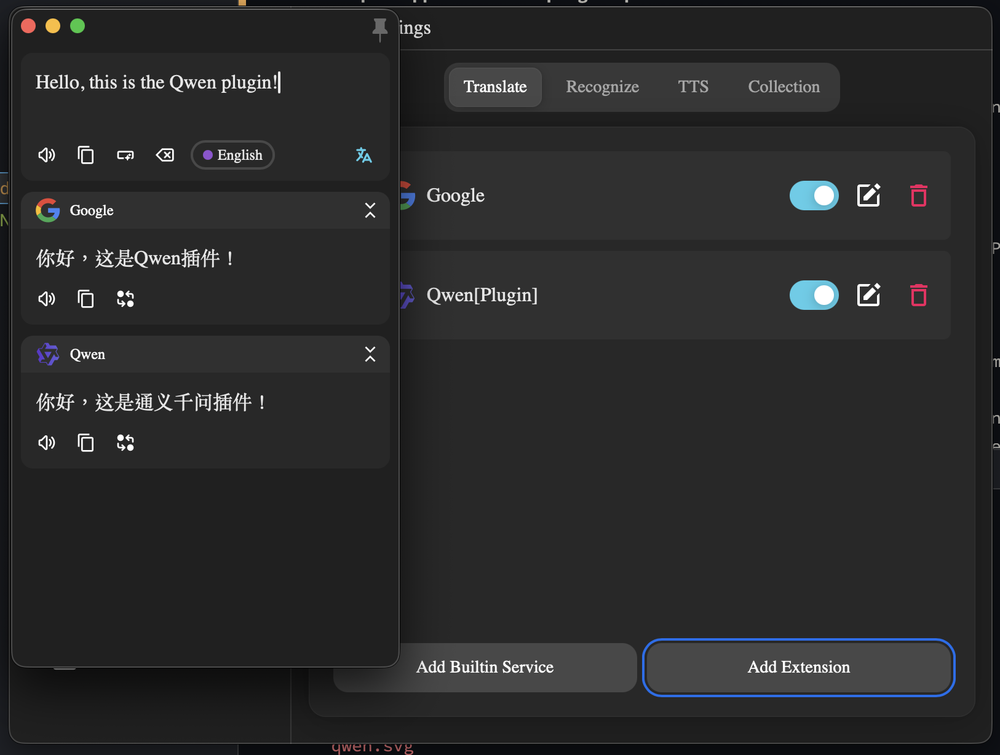

# pot-app-translate-plugin-qwen

[中文](README_CN.md)

A [Pot](https://github.com/pot-app/pot-desktop) translate plugin that uses Alibaba Cloud DashScope API to call Qwen series models for text translation.

## Screenshots





## Configuration

After installing the plugin, configure the following fields in Pot's plugin settings:

| Field | Required | Default | Description |
|-------|----------|---------|-------------|
| YOUR Qwen api key | Yes | - | DashScope API key, obtained from [Alibaba Cloud Model Studio](https://bailian.console.aliyun.com/) |
| model | No | qwen-flash | Model name, e.g. `qwen-flash`, `qwen-plus`, `qwen-max` |
| Base URL | No | `https://dashscope.aliyuncs.com/api/v1/services/aigc/text-generation/generation` | API endpoint, change to `https://dashscope-intl.aliyuncs.com/...` for international users |
| System Prompt | No | Built-in translation prompt | Custom system prompt for translation behavior |

## Supported Languages

Auto-detect, Simplified Chinese, Traditional Chinese, English, Japanese, Korean, French, Spanish, Russian, German, Italian, Turkish, Portuguese (Portugal/Brazil), Vietnamese, Indonesian, Thai, Malay, Arabic, Hindi, Mongolian (Cyrillic/Mongolian script), Khmer, Norwegian (Bokmal/Nynorsk), Persian.

## Build

Run from the project root directory:

```bash
# Using shell script
bash build/build.sh

# Or using Python script
python3 build/build.py
```

Both scripts generate `build/plugin.com.pot-app.sc.qwen.potext`.

GitHub Actions will automatically build and upload the `.potext` artifact on every push, and attach it to a release when a tag is pushed.

## Install

1. Download the `.potext` file from a release or build it yourself
2. Open Pot -> Preferences -> Service Settings -> Translate -> Add External Plugin -> Install External Plugin
3. Select the `.potext` file
4. Add the plugin to the service list and configure your API key

## License

GPL-3.0
